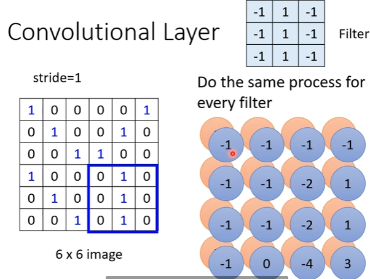
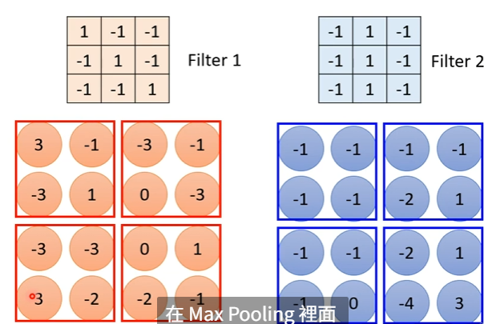
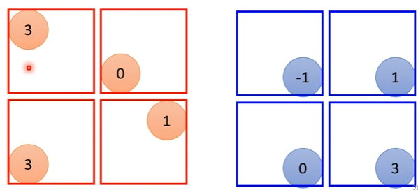
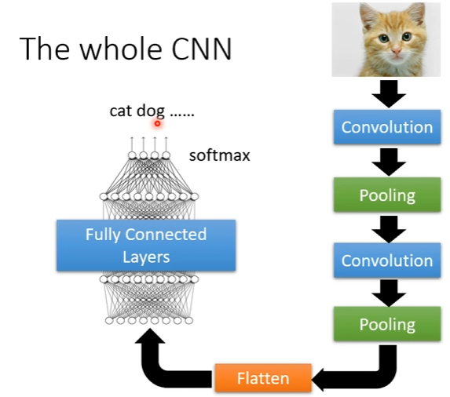

# 卷积神经网络（CNN）
## 特征
### 感受野
- 全连接会导致参数量过大，引入局部连接提取特征
- **卷积核**：不同的卷积核可以选出不同的特征；卷积核大小决定每次选取多少像素点
- **步长**：每次滑动的距离
### 权重共享
- 某些神经元要提取相同的特征，可以使用相同的参数。  
即一个**filter**可以看作多个参数相同的**neuron**
## 卷积过程
- 每一个filter对图片扫一遍就叫卷积，会得到特征图，用来识别某一种特征    
    卷积一次之后相当于形成一张新图片，新图片的通道数就是filter的数目
  
- 当卷积层数越深时，看到的图片范围越大，所以不用担心卷积核太小不能识别出特征  
## 池化（pooling）
- 作用：将图片变小，channel不变，实际操作中将卷积层和池化层交替使用
- pooling没有参数，不需要学习
- 最大池化  
池化前：
  
池化后：

## 全过程  

Flatten：将多维矩阵拉直变成一个向量
## 应用
- 专为图像识别设计，例如围棋AlphaGo
## 缺点
- 不能处理图片放大缩小后的识别