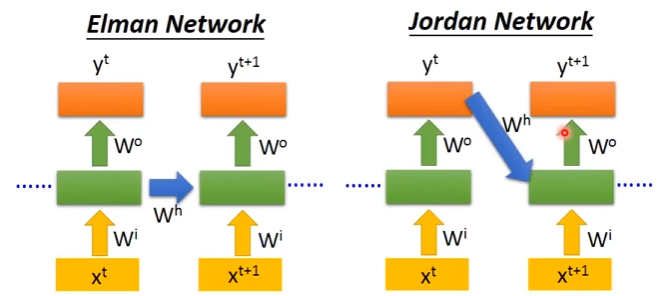
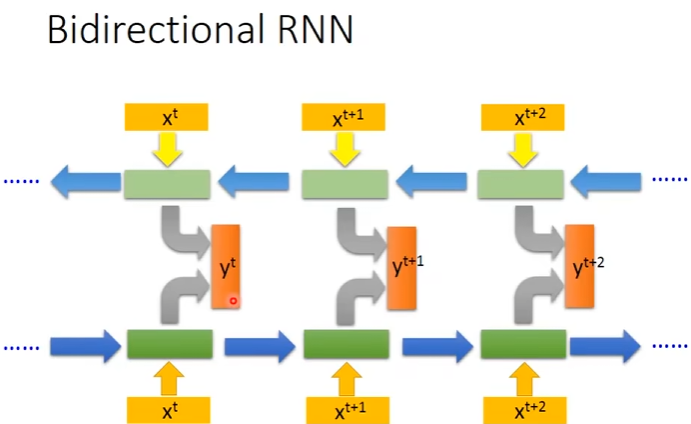
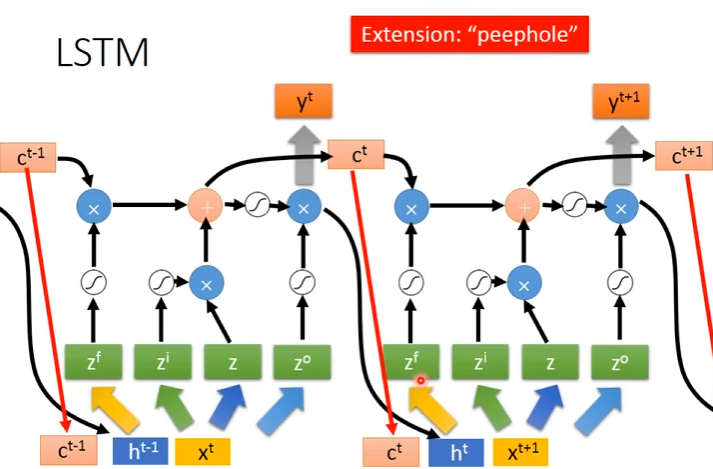
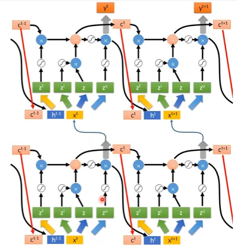

# 循环神经网络（Recurrent Neural Network）
- 针对序列数据（文本、语音）
- 具有记忆功能，对于每一层，之前的输出会存储到memory，从而作为输入影响下一次的输出  
- 核心思想在于**循环连接**
 
- 输入序列的顺序不同会导致输出不同。下面是对一个句子的处理流程：        
a1：隐藏层输出       
y1：最终输出        
同一个network被调用多次，相同颜色的模中参数相同

- 不同的网络架构：  
Elman Network：将隐藏层的输出存储   
Jordan Network：将最终输出存储  
Bidirectional RNN：双向读取
  
  
# LSTM（Long Short-term Memory）
- 为memory增加了“门”
- 四个输入：一个数据信号，三个控制信号  
input：想要存入memory的数据 
Input Gate：控制是否能够存入    
Output Gate：控制是否能够输出存储的memory   
Forget Gate：控制原memory是否保存  
  
- 具体计算流程如下，激活函数使用sigmoid函数：

- 一层：  
  
多层：  
