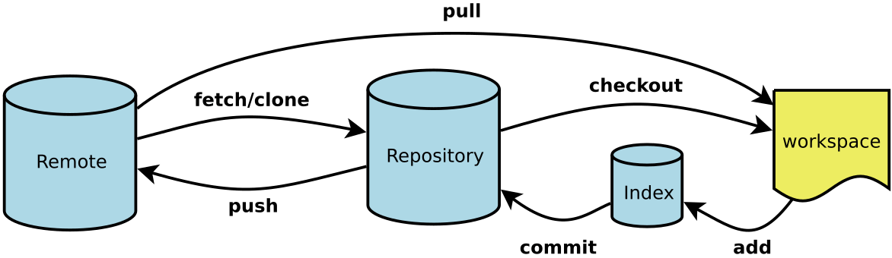

# git笔记
## 一、 git简介
**git** : 最先进的 *分布式版本控制系统*  
**工作流程** ：

- workshop：工作区  
- Index/Stage：暂存区
- Repository：本地仓库
- remote：远程仓库
## 二、 SVN与Git
**SVN** ：集中式版本控制系统（版本库在中央服务器，使用前从中央服务器获取最新版本，完成后再推送回去，联网工作，受网速限制）  
**Git**： 分布式 无中央服务器 
## 三、 基础操作
1. **配置全局用户信息**  
   （`--global` 参数表示此配置适用于本机所有 Git 仓库）  
   ```bash
   git config --global user.name "lyd"
   git config --global user.email "lyd@example.com"
2. **创建版本库**  
    将当前文件夹变为Git仓库（运行后出现 .git 文件）
    ```bash
    git init
3. **将新文件添加到暂存区**
    ```bash
    git add newfile.txt
4. **提交到本地仓库**
    ```bash
    # 提交暂存区的所有更改（打开编辑器输入提交信息）
    git commit
    # 提交并直接添加提交信息（避免打开编辑器）
    git commit -m "提交信息描述"
    # 提交时添加详细描述（多行信息）
    git commit -m "标题" -m "详细描述..."
    # 跳过暂存区
    git commit -a -m "提交信息"
5. **查看文件提交情况**
    ```bash
    git status
6. **查看文件修改了什么内容**
    ```bash
    git diff filename
7. **查看历史提交记录**
    ```bash
    #完整信息
    git log
    #简化版
    git log --pretty=oneline
    #查看所有分支和 HEAD 的移动历史（包括已删除的“提交”）
    git reflog
8. **版本回退**
    ```bash
    #回退到上个版本
    git reset --hard HEAD^
    #回退到上上个版本
    git reset --hard HEAD^^
    #回退到前一百个版本
    git reset --hard Head~100
    #回退到指定版本
    git reset --hard 版本号
9. **撤销修改**
    ```bash
    #撤销在工作区的全部修改
    git checkout 
10. **删除文件**  
    （可以直接在文件目录中删除或者使用`rm`命令，之后`commit`，文件就被彻底删除）  在`commit`前可以使用如下命令恢复：
    ```bash
    git checkout -- file
## 四、远程仓库
1. **添加远程仓库**
    ```bash
    git remote add origin https://...
    # 远程仓库的默认名称是origin
2. **本地内容推送到远程**
    ```bash
    git push [远程仓库名] [本地分支名]:[远程分支名]
    # 推送本地分支并建立跟踪关系
    git push -u origin master
    # 后续推送可直接使用（无需参数）
    git push
3. **克隆远程库到本地**
    ```bash
    git clone [远程仓库地址]
## 五、分支操作
1. **创建与合并分支**
    ```bash
    # 创建分支并切换到该分支
    git checkout -b name
    # 创建分支
    git branch name
    # 切换分支
    git checkout name
    # 查看分支
    git branch
    # 合并指定分支到当前分支上（默认“fast forward”模式，丢掉被删分支信息）
    git merge name
    # 合并分支（禁止fast forward模式）
    git merge --no-ff name
    # 删除dev分支
    git branch -d name
2. **分支管理策略**  
    master分支：稳定分支，用来发布新版本，不许直接在上面工作。一般在新建的dev分支上完成工作，稳定后合并到master分支。
3. **bug分支**
    ```bash
    # 隐藏当前工作现场（隐藏后`git status`查看显示clean）
    git stash
    
    # 隐藏后新建临时bug分支，修复完成后切换到master分支，并完成合并，最后删除bug分支

    #查看工作现场
    git stash list

    # 恢复之前的工作现场
    #方法1：stash内容不删除
    git stash apply
    #删除stash内容
    git stash drop
    #方法2：恢复同时删除stash内容
    git stash pop
4. **多人协作**
    ```bash
    # 查看远程库信息
    git remote
    # 详细信息
    git remote -v
    # 推送本地分支
    git push origin master
    # 创建并切换到基于远程分支的本地分支
    git checkout –b dev origin/dev