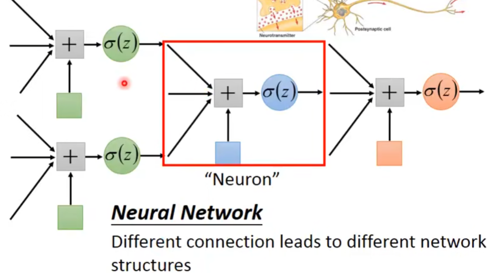
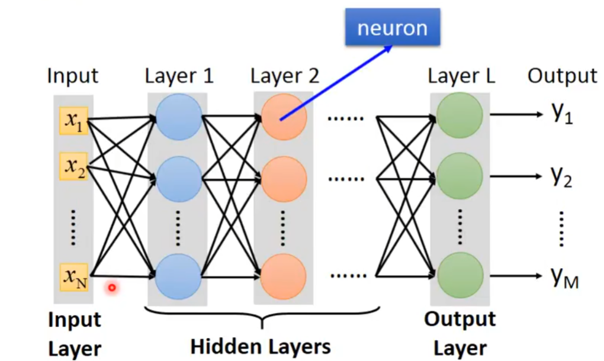
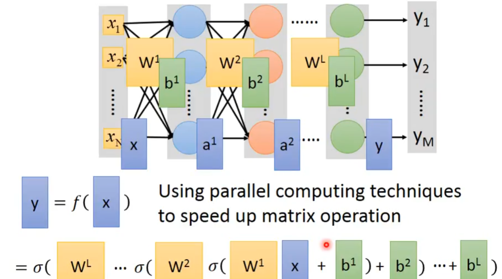
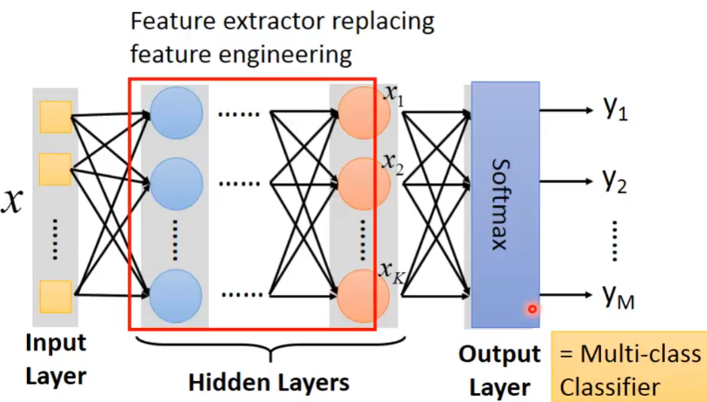

# Deep Learning
- 定义：机器学习中的function换为**Neural Network**  
deep：多个隐藏层  
  
## Neural Network
- Fully Connect Feedforward Network：全连接前馈网络（多层感知机）  
全连接：每层的每个神经元都与下一层的所有神经元相连接  
前馈：信息单向流动：从输入层 → 隐藏层 → 输出层
  
矩阵运算：
  
输出层：也看做多分类，使用**Softmax函数**  

