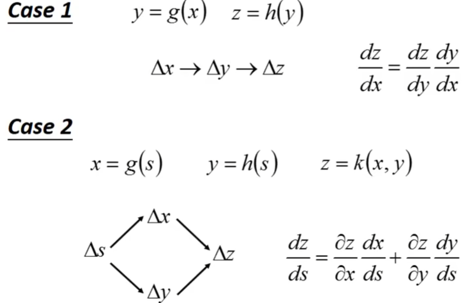
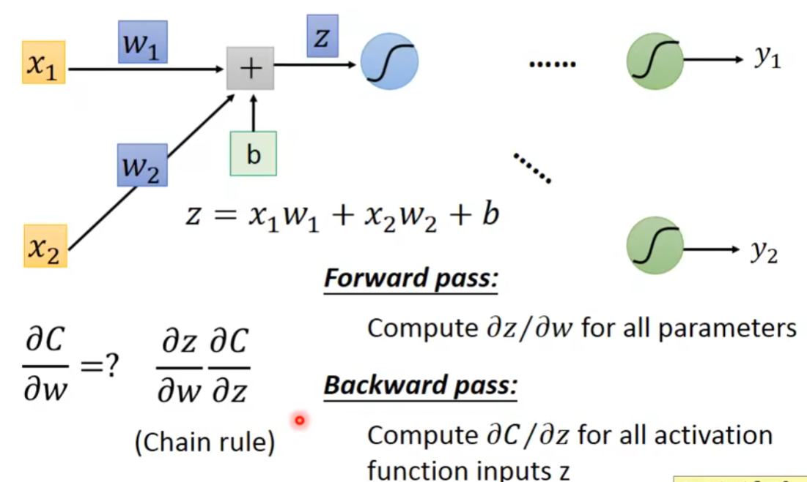
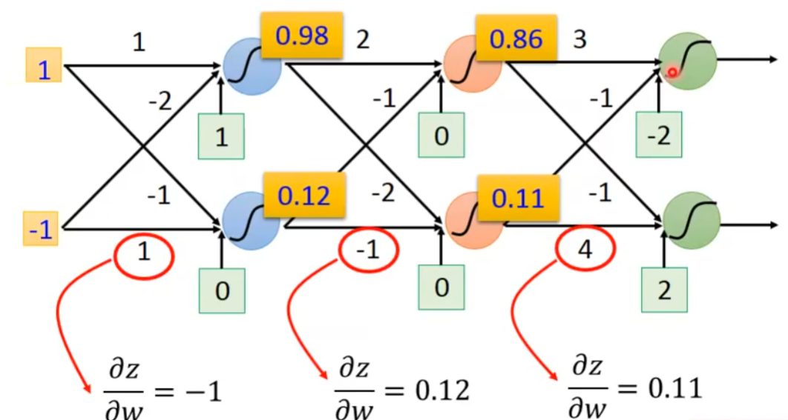
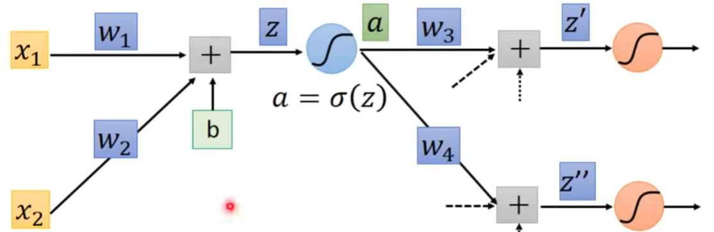
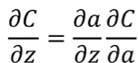
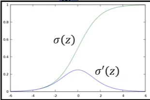
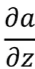
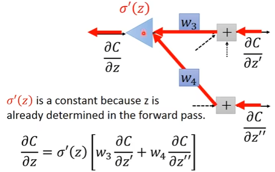
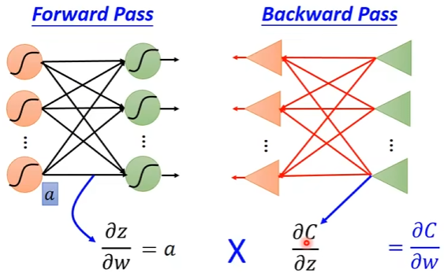

# BackPropagation（反向传播）
- 原理：链式法则  

- 正向传播和反向传播  

  - Forward Pass  
为什么z对w的微分叫正向传播：  
因为只要一直往前计算，知道i-1层的输出，就可以知道第i层中z对w的微分，如下图  
  
  - Backward pass  
    
  由上图及链式法则可得：  
  因为sigmoid函数及其微分如下：  
    
  所以可算得：  
  由链式法则得：  
  在正向传播时z已经确定，所以对z的微分是一个常数  
    
  为什么叫反向传播：知道后一个可递归得前一个的微分
- 总结：反向传播相当于构建一个方向相反的神经网络，计算就相当于正向传播  
