# Pytorch
## 基本介绍
- **pytorch**：python中的机器学习框架  
- 特点：  
  - 加速张量运算  
  - 打包好的梯度计算  
## 使用过程
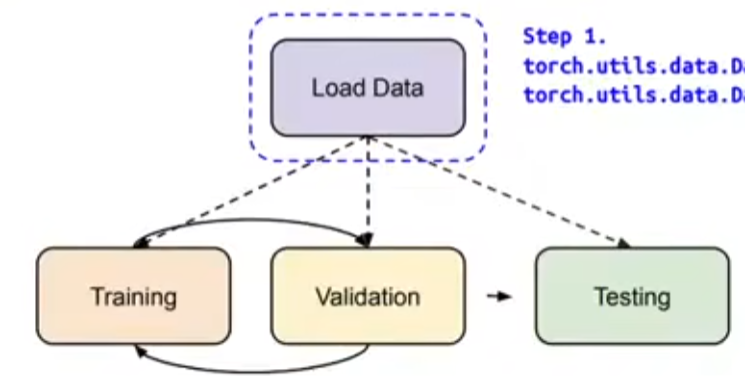  
1. **Load Data**  
    torch.utils.data.Dataset & torch.utils.data.DataLoader  
    dataset：读取样本数据和期望值并打包  
    dataloader：将dataset打包好的数据合并为batch,可并行加载
    ```python
        dataset=MyDataset(file)
        # shuffle：每个epoch是否随机打乱数据，Training：True，Testing：False
        dataloader=DataLoader(dataset,batch_size,shuffle=True)
    ```
    定义自己的Dataset：
    ```python
        fron torch.utils.data import Dataset,DataLoader
        class MyDataset(Dataset) :
            # 读数据，预处理
            def _init_(self, file):
                self.data = ...
            # 依次获取每一个样本
            def __getiten__( self, index) :
                return self.data[index]
            # 获取数据数量
            def _len__( self):
                return len(self.data)
    ```
    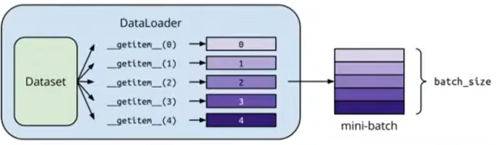  
    ---
    **张量（Tensors）**：高维阵列  
    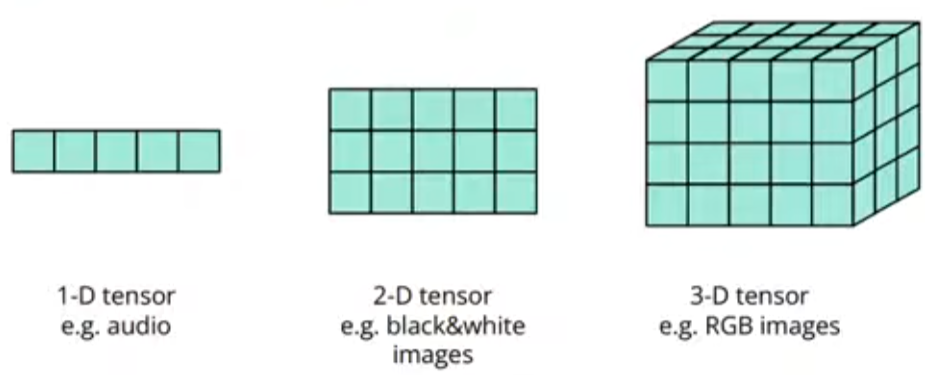  
    - 可以使用  .shape() 函数获取张量各维度数值  
        **dim** in PyTorch == **axis** in NumPy  
        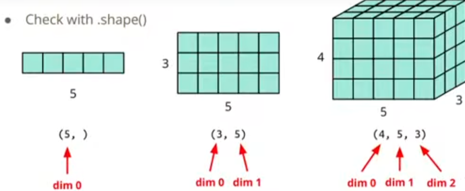
    - 新建张量
      - 从其他数据中创建  
      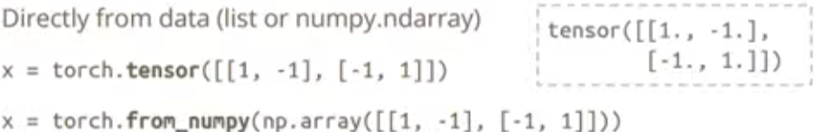  
      - 直接创建  
      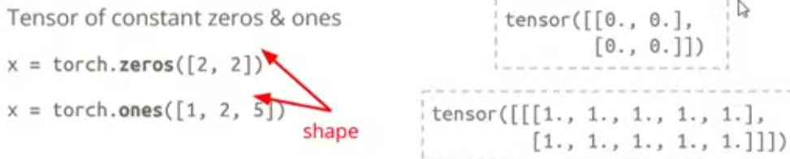
    - 常用操作：
    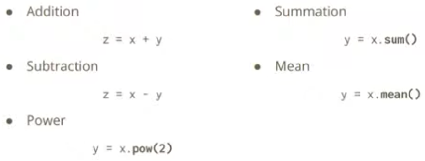  
        ```python
        # 转置，将第0个维度和第一个互换
        x=x.transpose(0,1)
        # 降维，将值为1的维度删除,原维度为[1,2,3],squeeze后变二维[2,3]
        x=x.squeeze(0)
        # 升维
        x=x.unsqueeze(0)
        ```
        合并：  
    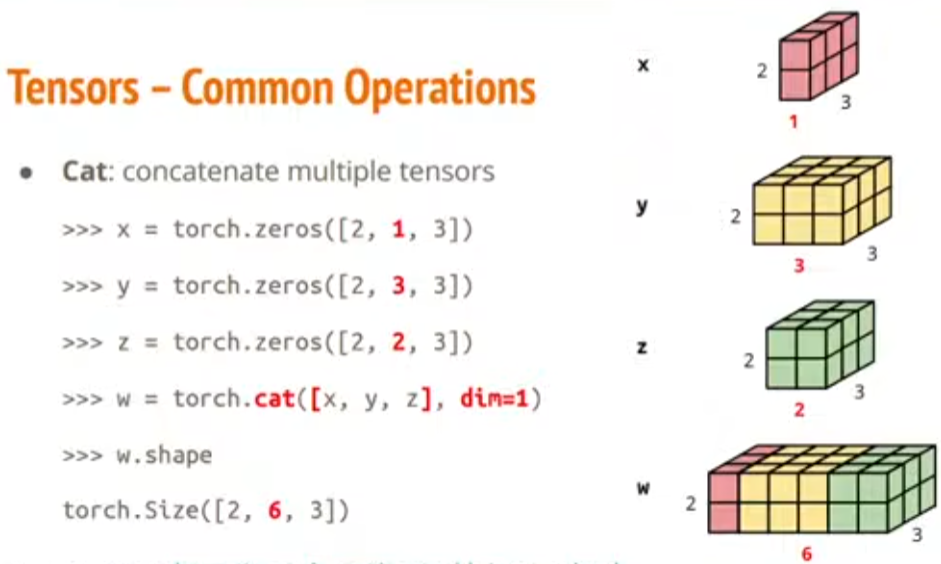  
    - CPU/GPU
        ```python
        # CPU(default)
        x=x.to('cpu')
        # GPU（多GPU时，cuda:0/cuda:1...)
        x=x.to('cuda')
        # 是否支持GPU加速
        torch.cuda.is_available()
        ```
    - 梯度计算  
    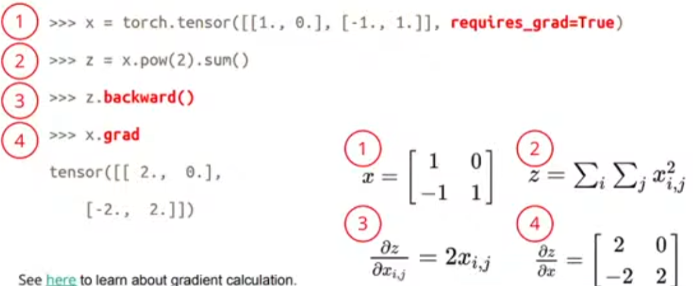
2. Training & Testing Neural Networks  
  - Network Layers
    - 全连接层（Linear Layer）  
    `nn.Linear(in_features, out_features)`  
    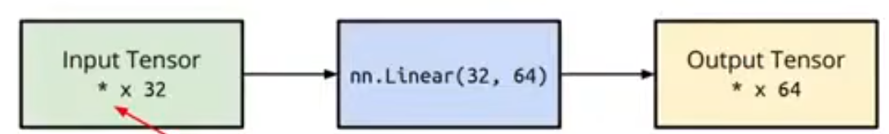
    - sigmoid  
    `nn.Sigmoid()`
    - ReLU  
    nn.ReLU()
  - 定义自己的神经网络  
  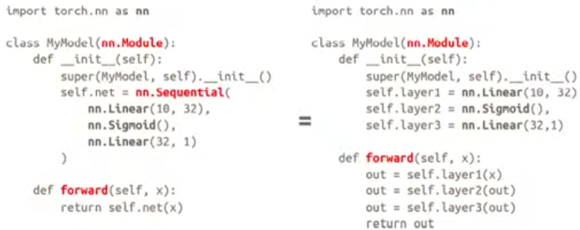
  - 损失函数
     ```python
     # MSE
     criterion = nn. MSELoss()
     #cross entropy
     criterion = nn.CrossEntropyLoss()
       
     loss = criterion( model_output，expected_value)
    ```
  - 优化
    ```python
    # SGD
    torch.optin.sGD(model.paraneters(), lr, momentum = 0)
    ```
3. 全流程
```python
    dataset = MyDataset(file)
    # read data via MyDataset
    tr _set = DataLoader(dataset,16，shuffle=True)
    # put dataset into Dataloader
    rodel = MyHodel( ).to(device)
    # construct model and nove to device (cpu/cuda)
    criterion = nn.MSELoss()
    # set loss function
    optinizer = torch.optin.sGD( rmodel.parareters(), 0.1)
    # set optirizer

    # training
    for epoch in range(n_epochs):
    iterate n_epochs
        model.train()
        # set model to train node
        for x, y in tr_set:
        # iterate through the dataloader
        optinizer .zero_grad()
        # set gradient to zero
        x, y = x.to(device)， y.to(device)nove data to device (cpu/cuda)pred = vodel(x)
        # forward pass (conpute output)
        loss = criterion(pred, y)
        # compute loss
        loss.backward()
        # conpute gradient (backpropagation)
        optinizer.step()
        # update rodel with optinizer

    # validation
    nodel.eval()
    # set model to evaluation node
    total_loss = 0
    for x, y in dv_set:
    # iterate through the dataloader
        x,y = x.to(device) , y.to(device)
        # move data to device (cpu/cuda)
        with torch.no_grad():
        # disable gradient calculation
            pred = podel(x)
            # forward pass (compute output)
            loss = criterion(pred,y)
            # compute loss
        total_loss += loss.cpu( ).iten() * len(x)
        # accunulate loss
        avg_loss = total_loss / len(dv_set.dataset)
        # conpute averaged loss
    
    # Testing
    nodel.eval()
    # set nodel to evaluation mode
    preds = []
        for x in tt_set:
        # iterate through the dataloader
        x = x.to(device)
        # move data to device (cpu/cuda)
        with torch.no_grad():
        # disable gradient calculation
            pred = nodel(x)
            # forward pass ( conpute output)
            preds.append(pred.cpu( ))
            # collect prediction
```   
**eval时为什么关闭梯度计算**：  
- 某些层（如Dropout、BatchNorm）在训练/评估模式行为不同
- 评估不需要反向传播，可以节省内存资源提高计算速度
- 防止模型参数意外更新