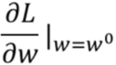
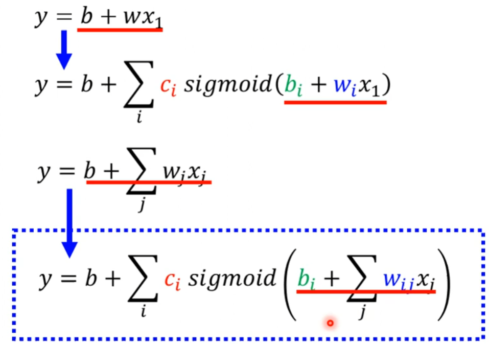

# 相关概念
- 机器学习 = 找函数  
- 深度学习 = 找类神经网络函数
- 函数输入：向量、矩阵（图片）、序列（声音讯号）
- 函数输出：数值（回归）、类别（分类）、文档图片
- 监督学习（supervised learning）：手工标记
- 自监督学习（self-supervised learning）：pre-train -> downstream tasks
- 生成对抗网络（GAN）：不需要输入和输出之间的对应关系
- 强化学习（reinforcement learning）：不知道如何标注，但有评价指标
- 异常检测（anomaly detection）：识别未知类别得能力
- 可解释性（AIexplainable AI）：可回答为什么知道
- 领域自适应（domain adaption）测试样本和训练样本分布不同
- 模型压缩（network compression）：
# 机器学习基本概念
## 常见任务：
**回归（regression）**：函数输出为值  
**分类（classification）**：输出为给定类别  
## 解决过程（以y=b+wx为例）：
1. **确定带未知参数的函数（*Model*）**    
    模型Model：*y=b+wx1*  
    特征feature：x,y  
    权重weight：w（未知）  
    偏置bias：b（未知）
2. **定义损失函数（*Loss*）**  
    输入为未知参数，输出表示参数好坏  
    y（label）：真实值  
    ŷ：预测值  
    e = |y-ŷ|：误差  
      
    误差计算方法：  
        - MAE：|y-ŷ|  
        - MSE：(y-ŷ)2  
3. **最优化（Optimization）**  
    - 目的：求解使L最小的参数值  
    - 方法：**梯度下降法（gradient descent）**  
    - 梯度下降法步骤：  
      - a. 设置初始w0  
      - b. 求L在w0处的偏微分：  
        
      更新w（η为超参数学习率）：  
      
      - c. 反复更新w  
      停止更新：达到最大迭代次数或刚好某处微分为0  
    
## 模型（Model）  
线性模型（Linear Model）：参数量太少，有时会导致模型偏差（model bias）过大，无法模拟真实情况  
  
可以使用组合方式表示该函数：  
  
以下**Piecewise Linear**函数都可以如此组合：

可以用Piecewise Linear逼近为Piecewise Linear曲线，进一步逼近任何连续曲线：  
  
**sigmoid 函数**：  
  
b，w，c对函数的影响：  

总结：  
- sigmoid函数 -> hard sigmoid -> Piecewise Linear -> Piecewise Linear曲线 - > 任意曲线
- 对线性模型优化，表示更多特征  
  
矩阵表示：  
  
参数含义：  

## 损失函数（Loss）
**L(θ)**：关于参数θ的函数，衡量参数的好坏  
  
## 最优化（optimization）
符号含义：  
  
步骤：  
- 选取初始值θ0
- 计算梯度（gradient）：  
  
- 反复迭代  
实际操作中会把样本分为若干个**batch**，分别计算L、gradient，用这些gradient依次更新参数，所有batch遍历一次叫一个**epoch**
## 激活函数sigmoid和ReLU
  
为什么是**2i**：因为2个ReLU叠加为一个sigmoid  

## 神经网络（Neural Network）、隐藏层（hidden layer）、深度学习（deep learning）
  
### 本质是多次地激活
## 过拟合（overfitting）
表现：在训练集上表现很好，在测试集上表现差