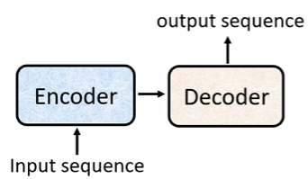
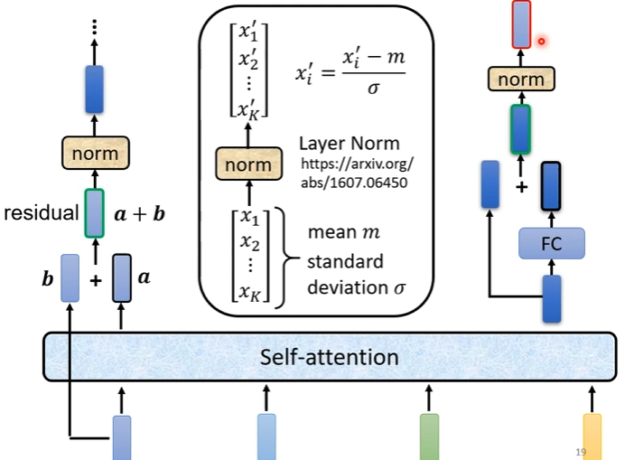
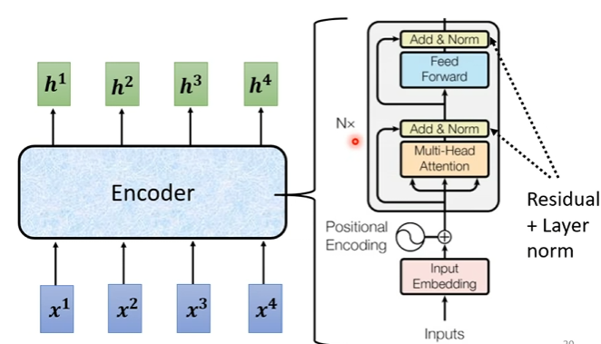
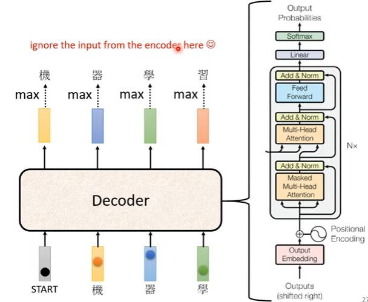
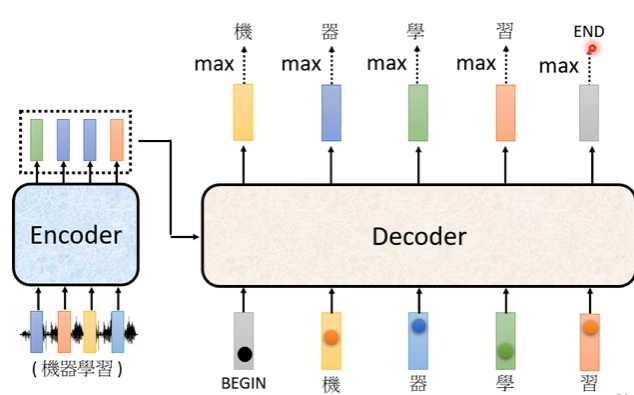
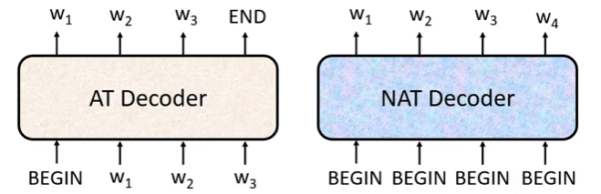
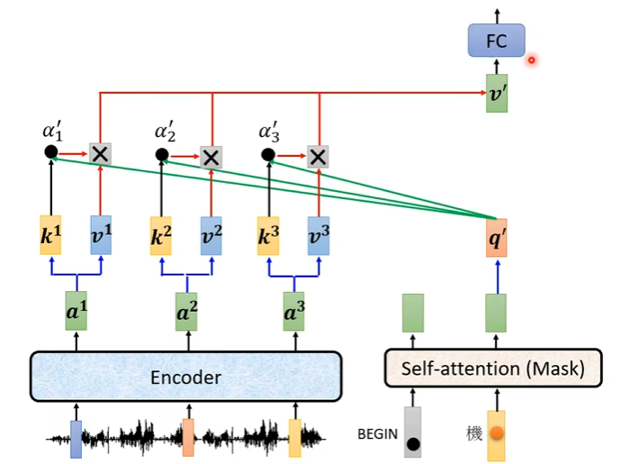

# Transformer
- seq2seq模型，可以处理如语音识别、机器翻译。transformer是一种seq2seq模型
- QA问题可以用seq2seq解决
- seq2seq的一般流程：  

- transformer中的encoder：  

- transformer中的decoder：
  - Autoregressive：
    
  如何判断结束：输出一个END编码  
  
  - Non-autoregressive  
  一次性输出，并行化
    
  怎么确定输出的长度：专门另外设一个预测器；或给尽可能多的begin，看哪里会输出end
- encoder和decoder之间的连接  
**cross attention**  
