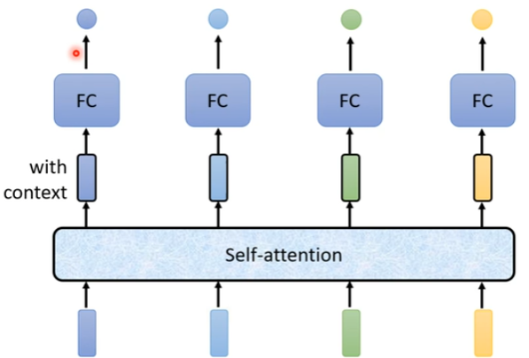
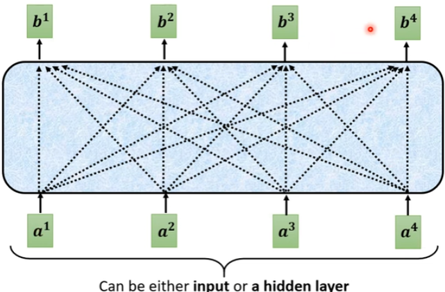
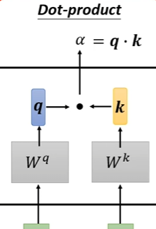
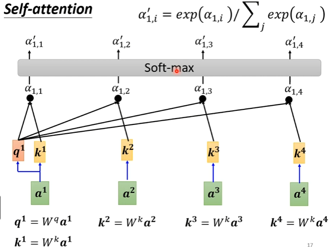
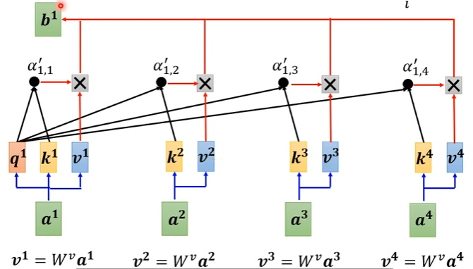
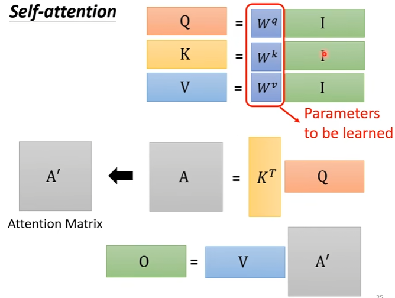
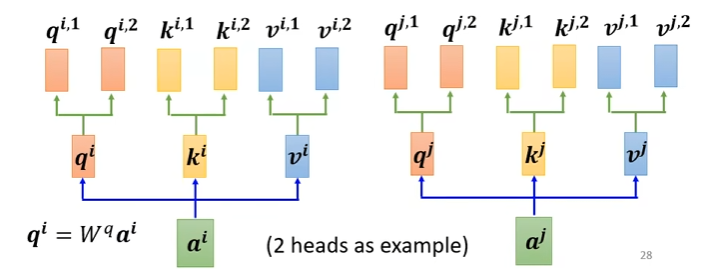
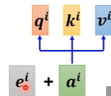
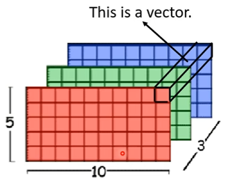
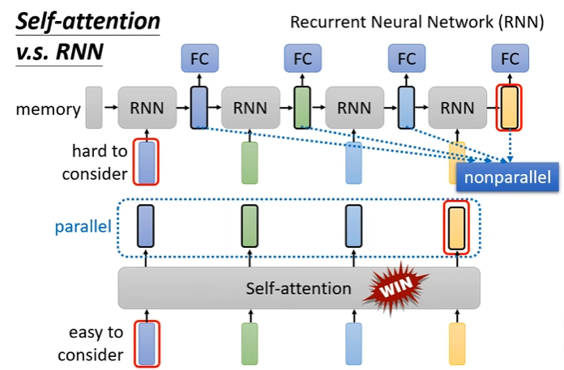

# 自注意力机制（self-attention）
## 问题情景
- 输入不是一个向量，而是多个向量，而且数量可能变化。  
例如文字处理、声音讯号、图Graph  
- 输出：  
    1、每一个输入向量都有一个对应的标签（Sequence Labeling）；  
    2、只需要输出一个标签；  
    3、模型自己决定输出多少个标签,比如语音辨识（**seq2seq**）
## Self-Attention原理
- 接受所有输入向量，输出相同数量的新向量，所以可以综合所有的信息  
  
- self-attention内部：
  
步骤：  
  - 计算任意两个向量之间的α（attention score），表示两个向量之间的关联程度，为了找出与a1相关的向量，常见计算方法如下：    
  向量a1、a2先分别乘一个矩阵Wq、Wk，得到向量q、k，然后计算q和k的Dot-product  
  
  - 对α激活得到α'  
  
  - 计算b1  
    
  - 矩阵表示：    
  I：输入向量拼接形成的矩阵
  
- 可以叠加很多次
## 改进版Multi-head Self-attention
用来处理不同种类的相关性  

## Positional Encoding位置编码
- 为了处理位置信息，为每一个位置设定一个向量e，将位置编码加到输入中

## 图片也可以引入self-attention
  
## CNN和self-attention的关系  
CNN可以看作简化版的self-attention，因为CNN每次只考虑一个感受野内的信息，而self-attention考虑全图；self-attention在特定限制下可以和CNN相同
## RNN和self-attention的关系  
- self-attention可以平行处理所有输出，而RNN需要先后计算，运算效率更低   

## self-attention用于图
- 图本身就包含了哪些节点之间是有关系的，所以可以无需计算部分节点之间的attention score，这就是一种类型的**GNN**