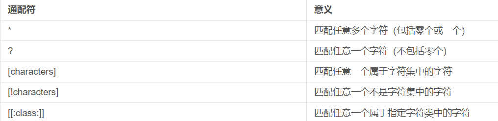

# 机器学习任务攻略
## 处理思路
  
## 训练数据集上损失过大
- model bias大  
  - 原因：模型太简单  
  - 解决方法：增加更多输入特征、使用DeepLearning
- optimization有问题
  - 可以先从浅层的简单模型入手，然后再处理深层模型
- 如何判断是那种问题  
    - 比较不同层数的模型  
    
## 训练集上损失小，测试集上损失大
- **过拟合（overfitting）**
  
解决方法：  
  - 数据方面：增加训练数据 
      
    **数据增强（data augmentation）**  
    
  - 模型方面：限制模型  
      
    方法：
      - 更少的参数或共享参数（如CNN）
      - 更少的特征（less feature）
      - 早停技术（early stopping）
      - 正则化（regularization）
      - dropout
- Mismatch：训练资料和测试资料分布不同
## 训练集和验证集划分
 - N折交叉验证  
 