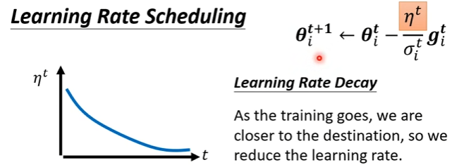

# 机器学习任务攻略
## 处理思路
  
## 训练数据集上损失过大
- model bias大  
  - 原因：模型太简单  
  - 解决方法：增加更多输入特征、使用DeepLearning
- optimization有问题
  - 局部最小值、鞍点处的梯度都是0，统称为critical point。local minima无法逃离，saddle point可逃离  
    
  无法下降不一定是遇到了critical point  
  
  - **Momentum**：相当于给原来的梯度下降增加一个**惯性**  
    
  - 自动调整学习率：在平缓方向的学习率尽量大，在陡峭方向的学习率尽量小  
    
  计算方法：平均方根（RMS）  
    
  **RMSProp**：相当于可以“急刹”，α设置得小，当前梯度的影响就会增加  
    
  **Learning Rate Schedule**  
  Learning Rate Decay：η随时间减小，离终点越近，η越小  
  
  Warm up：  
  
  - **Adam**：RMSProp+Momentum  
  
- 如何判断是那种问题  
    - 比较不同层数的模型  
    
## 训练集上损失小，测试集上损失大
- **过拟合（overfitting）**
  
解决方法：  
  - 数据方面：增加训练数据 
      
    **数据增强（data augmentation）**  
    
  - 模型方面：限制模型  
      
    方法：
      - 更少的参数或共享参数（如CNN）
      - 更少的特征（less feature）
      - 早停技术（early stopping）
      - 正则化（regularization）
      - dropout
- Mismatch：训练资料和测试资料分布不同
## 训练集和验证集划分
 - N折交叉验证  
   
 ## Batch的作用
   - large batch：大招，蓄力长，效果稳定  
   因为有并行运算，所以大的batch也不需要更长的时间去计算梯度，但是太大，达到并行计算能力上限时，计算时间也会增加  
      
   - small batch：平a，cd短，波动大  
   - 小batch的设置有助于走出critical point，因为butongbatch相当于LOSS函数有差异  
     
   - 小batch的训练结果在测试集上的表现优于大batch  
     
   - 总结对比  
     
   ## SoftMax
   - 二分类问题：直接使用**sigmoid函数**，将任意实数映射成为一个（0,1）区间的数值，一个0,1）区间的数值恰好可以用来表示概率：
   - 多分类问题：使用**softmax**函数。将一个数值向量归一化为一个概率分布向量（大小为0到1），且各个概率之和为1。Softmax可以用来作为神经网络的最后一层，用于多分类问题的输出。Softmax层常常和***交叉熵***损失函数一起结合使用。  
       
   流程示意：  
   
   交叉熵（cross-entropy）：  
   
   ## 标准化（Normalization）
   - 产生原因：因为输入的不同维度大小差异很大，所以不同参数的变化率差异很大，不利于优化  
     
   - Feature Normalization  
   准备工作：对所有输入向量的某一维求平均值mean和标准差standard deviation。  
     
   效果：让梯度下降收敛更快  
   在深度学习中需要对每一层都做标准化处理；  
   标准化使得一个batch中的所有输入彼此关联，形成一个整体网络。  
   因为标准化后的输入均值为0，为了防止这一特征对网络造成负面影响，需要引入γ、β进行调整：  
     
   - 在测试时通常没有batch，μ和σ怎么获得呢？求均值  
     
   