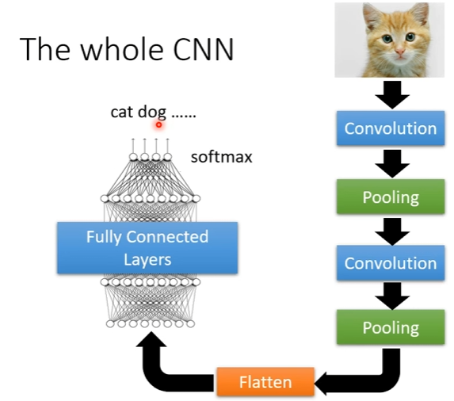

# 卷积神经网络（CNN）
## 特征
### 局部连接
- 全连接会导致参数量过大，引入局部连接提取特征
- **卷积核**：不同的卷积核可以选出不同的特征；卷积核大小决定每次选取多少像素点
- **步长**：每次滑动的距离
### 权重共享
- 某些神经元要提取相同的特征，可以使用相同的参数
## 卷积过程
- 每一个filter对图片扫一遍就叫卷积，会得到特征图：  
  
## 池化（pooling）
- 作用：将图片变小，实际操作中将卷积层和池化层交替使用
- 最大池化  
池化前：
  
池化后：

## 全过程  
