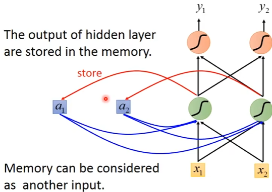
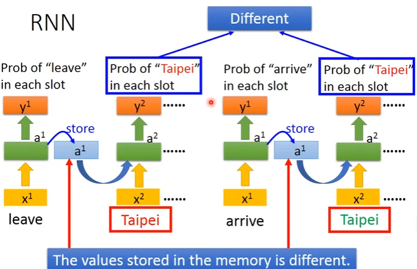
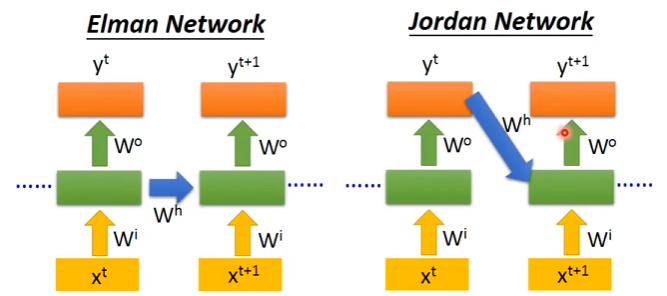
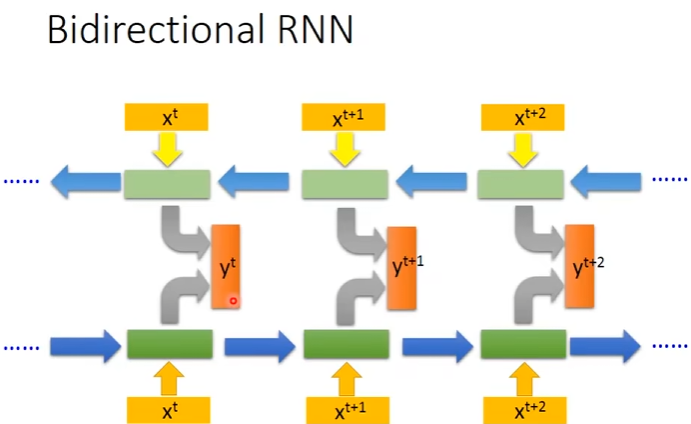
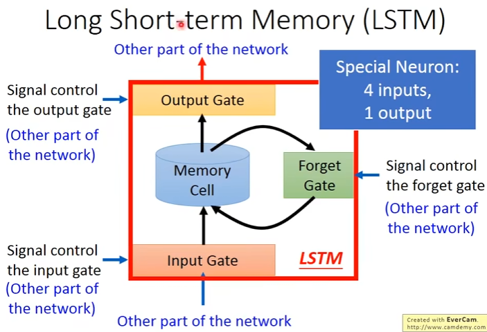
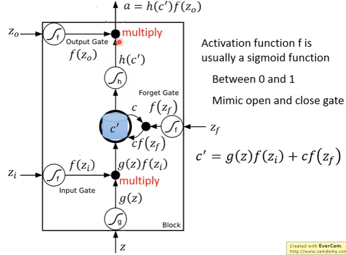

# 循环神经网络（Recurrent Neural Network）
- 对于每一层，之前的输出会存储到memory，从而作为输入影响下一次的输出  
 
- 输入序列的顺序不同会导致输出不同。下面是对一个句子的处理流程：   

- 不同的网络架构：
  
  
# LSTM（Long Short-term Memory）
- 为memory增加了“门”
- 四个输入：一个数据信号，三个控制信号  
  
- 具体计算流程如下，激活函数使用sigmoid函数：
