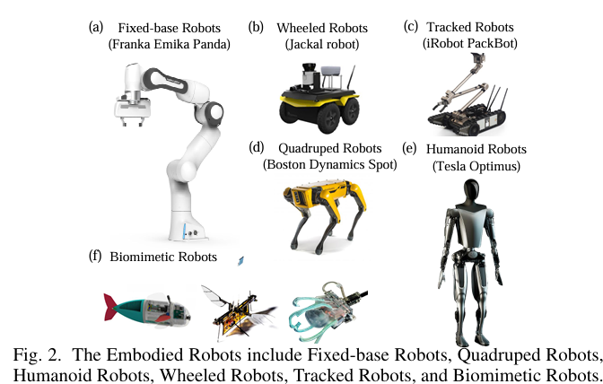
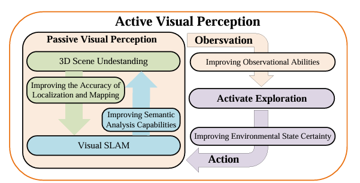
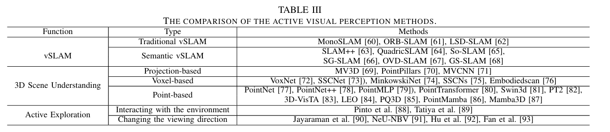
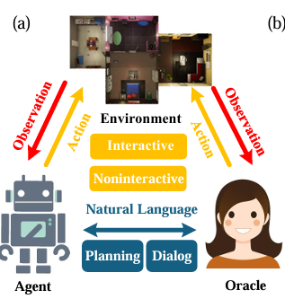
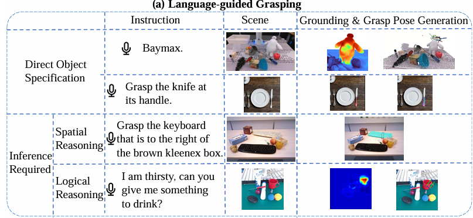
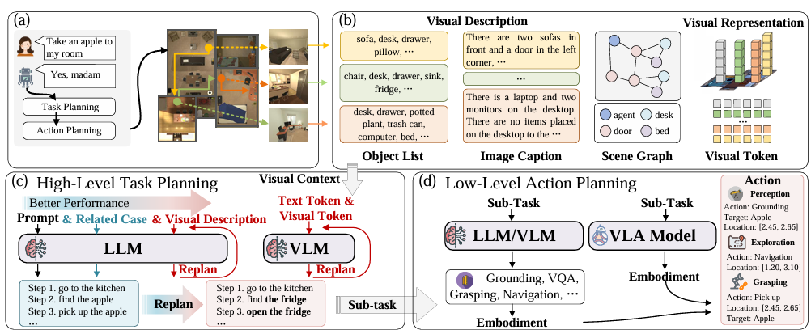
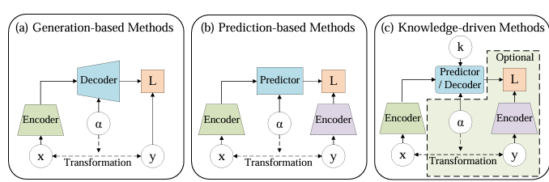
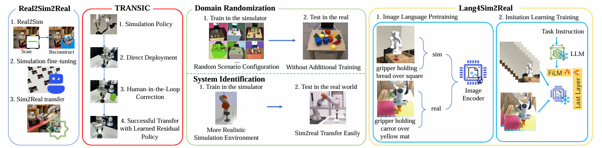

# Aligning Cyber Space with Physical World: A Comprehensive Survey on Embodied AI
**论文标题**：Aligning Cyber Space with Physical World: A Comprehensive Survey on Embodied AI   
**作者**：Yang Liu, Weixing Chen, Yongjie Bai, Xiaodan Liang, Guanbin Li, Wen Gao, Liang Lin    
**年份**：2024
## 一、核心贡献
### 1.1 总体定位
本文是**MLM（多模态大模型）时代首篇全面综述具身智能（Embodied AI）的论文**。具身智能被认为是实现通用人工智能（AGI）的关键路径，其核任务是让智能体不仅能在虚拟空间中解决抽象问题，更能驾驭物理世界的复杂性与不确定性
### 1.2 主要贡献
1. 系统梳理了**具身机器人**与**仿真平台**的前沿进展。     
论文首先对具身机器人和仿真平台进行了全面调研，帮助读者理解当前研究焦点及其局限性。  
    - 在机器人方面，涵盖了固定基座机器人（Fixed-base Robots）、轮式机器人（Wheeled Robots）和履带式机器人（Tracked Robots）等多种形态；
    - 在仿真平台方面，分为 **General Simulator**和 **Real-SceneBased Simulators**两大部分。具体从高保真物理仿真、高质量图形渲染、丰富机器人库、深度学习支持、大规模并行计算、ROS集成、多传感器仿真、跨平台等多个维度对主流仿真器进行了系统对比
2. 提出了四大核心研究任务框架   
    论文将具身AI的研究目标系统化为四个核心方向：
    - **具身感知（Embodied Perception）**     
        - 包括主动视觉感知（ Active Visual Perception） 
        - 视觉语言导航（Visual Language Navigation）  
    - **具身交互（Embodied Interaction）** ——智能体与环境和人类的自然交互   
        - 具身问答（EQA：Embodied Question Answering）
        - 具身抓取（Embodied Grasping）
    - **具身智能体（Embodied Agent）** ——能感知环境并采取行动的自主实体   
        - 具身任务规划（Embodied Task Planning）
        - 具身动作规划（Embodied Action Planning）
    - **仿真到现实的适应（Sim-to-Real Adaptation）** ——将仿真环境中的知识和技能迁移到真实世界      
        - 具身世界模型（ Embodied Action Planning）
        - 数据收集与训练
        
    每个方向都涵盖了SOTA方法、核心范式和全面的数据集
3. 深入探讨了**MLMs**在具身智能体中的作用   
    论文专门探讨了多模态大模型（MLMs）在虚拟和真实具身智能体中的复杂性，强调了它们在促进数字和物理环境交互中的重要意义。MLMs为具身模型注入了强大的感知、交互和规划能力，使得开发通用具身智能体和机器人成为可能。    
4. 提出了**ARIO数据集标准**  
    论文提出了一种新的数据集标准——ARIO（All Robots In One） ，并构建了统一的大规模ARIO数据集，包含约300万个episodes，覆盖258个系列和321,064个任务。ARIO旨在通过提供统一的数据格式、全面的感官模态（图像、点云、文本、触觉、听觉五种模态）以及真实世界与模拟数据的组合，推动通用机器人智能的发展
## 二、方法概述
### 2.1 综述架构
    论文采用结构化文献综述方法，按照“基础平台 → 核心任务 → 关键使能技术 → 未来展望”的逻辑层层推进   
### 2.2 四大核心任务的方法论
（1）**具身感知**（Embodied Perception）    
具身感知要求智能体在动态、复杂的环境中主动感知和理解多模态信息。论文从两个子方向展开：

- 主动视觉感知（Active Visual Perception） ：智能体通过主动控制传感器（如摄像头）的位姿来获取更有信息量的视觉观测，以支持后续的导航和操作任务。

- 视觉语言导航（Visual Language Navigation） ：智能体根据自然语言指令在未知环境中进行导航，需要同时理解视觉场景和语言指令。

核心技术包括：预训练视觉表征（用于精确估计物体类别、姿态和几何信息）和大语言模型（用于理解人类语言指令）。

（2）具身交互（Embodied Interaction）   
- EQA：智能体需要通过主动探索建立对环境的情节记忆（episodic memory） ，并基于此回答问题。这与静态的视觉问答（VQA）有本质区别——智能体必须先"行动"才能获得回答所需的视觉信息。    

| 方法类别 | 具体方法/技术 | 说明 |
|---------|-------------|------|
| **视觉-语言模型（VLMs）** | CLIP、LLaVA等 | 处理视觉感知与语言理解的跨模态对齐 |
| **工具增强推理** | ToolEQA等 | 集成外部工具进行多步推理，获取完成任务所需的额外信息 |
| **主动感知与注意力机制** | FAST-EQA等 | 智能地聚焦场景中的关键区域，实现更快更可靠的问答 |
| **认知地图** | 基于VLM的室内环境问答系统 | 利用视觉-语言模型构建环境的认知表征 |
| **评估方法** | LLM-Match（基于LLM的正确性度量） | 用于评估开放词汇问答的准确性 |

- 具身抓取
    - 传统机器人运动学抓取方法  
    将传统机器人运动学抓取与大规模模型相结合，使智能体在多重感知下执行抓取任务。传统的抓取方法基于显式规则和运动学约束，生成符合物理稳定性的抓取姿势
    - 语言引导抓取（Language-Guided Grasping）方法  
    语言引导抓取融合了多模态大模型（MLMs），使智能体具备语义场景推理能力，能够基于隐性或显性的人类指令执行抓取操作

（3）具身智能体（Embodied Agent）      
这是具身AI最核心的研究方向。具身智能体需要：    
- 充分理解人类意图（语言指令）
- 主动探索周围环境
- 全面感知虚拟和物理环境中的多模态元素
- 针对复杂任务执行适当的动作

论文从两个层面展开：
- 具身多模态基础模型：将MLMs作为具身智能体的“大脑”，实现视觉与语言表征的对齐

    机器人基础模型的演进路径：
    
| 阶段 | 模型 | 架构特点 |
|------|------|---------|
| **第一阶段（分离式）** | SayCan | 使用**三个独立模型**分别处理规划（planning）、可供性（affordance）和低层策略（low-level policy） |
| **第二阶段（部分统一）** | Q-Transformer | **统一了可供性和低层策略** |
| | PaLM-E | **统一了规划和可供性** |
| **第三阶段（完全统一）** | RT-2 | **将规划、可供性和低层策略全部整合到单一模型中**，实现了联合扩展和正迁移 |
| **第四阶段（层级化）** | RT-H | 实现**具有动作层级的端到端机器人Transformer**，在细粒度层面推理任务规划 |
- 具身任务规划：利用MLMs的推理能力进行复杂任务的分解与规划
    - 高层任务规划（High-level Embodied Task Planning） ：将抽象、复杂的任务分解为具体的子任务——这属于“行动前的思考”，通常在网络空间（cyber space） 中进行
    - 低层动作规划（Low-level Embodied Action Planning） ：逐步执行这些子任务，利用感知和交互模型或基础模型的策略函数——这需要考虑与环境的有效交互，并将反馈信息传递给任务规划器以调整规划

（4）仿真到现实的适应（Sim-to-Real Adaptation）     
由于在真实机器人上直接训练成本高、风险大，仿真训练是必经之路。该任务致力于缩小仿真与真实世界之间的差距。论文从以下角度展开：
-  具身世界模型（Embodied World Models）
    - 核心思想：世界模型（WMs）是智能体内部对物理世界运行规律的模拟。它们不仅能预测未来状态，更能展现对物理规律（如重力、碰撞、因果关系）的理解。

    - 技术路径：WMs可以作为“内部仿真器” 。通过在“脑海”中进行无数次模拟推演，智能体可以在执行真实动作前预判后果，从而提升决策的安全性和效率。这种内部模拟与外部物理仿真器的结合，是弥合Sim-to-Real鸿沟的关键

-  数据收集与训练（Data Collection and Training）

    - 核心思想：为了解决真实世界数据的稀缺问题，研究者致力于开发更高效、更真实的数据收集范式。

    - 技术路径：

        - 真实机器人数据：尽管成本高昂，但高质量的真实机器人数据集（如论文中提出的ARIO数据集）至关重要。

        - 仿真数据增强：利用仿真器生成海量、带标注的数据，并通过域随机化（Domain Randomization）等技术，让模型在仿真中见过足够多的“变化”，从而更好地泛化到真实世界。

        - 数据金字塔：构建从仿真到真实的数据层级结构，实现不同来源、不同保真度数据的有效利用。
### 2.3 关键使能技术
论文强调了两类关键技术：

- 多模态大模型（MLMs） ：为具身智能体提供了强大的感知、交互和推理能力，是具身智能体最有前景的“大脑”架构。代表性工作包括RT-2和RT-H。

- 世界模型（WMs） ：通过模拟物理世界，帮助具身模型理解物理规律，弥补了纯数据驱动方法在物理常识方面的不足。

### 2.4 3.4 数据集贡献：ARIO
论文提出的ARIO数据集标准具有以下特点：

- 统一数据格式：标准化不同来源、不同机器人平台的数据
- 全面感官模态：包含图像、点云、文本、触觉、听觉五种模态
- 真实+模拟组合：同时涵盖真实世界数据和模拟数据
- 大规模：约300万episodes，覆盖258个系列和321,064个任务

## 三、关键图表
### 3.1 具身机器人主要类别

### 3.2 具身感知
#### 3.2.1 Active Visual Perception
    
视觉SLAM和三维场景理解为被动视觉感知提供基础，而主动探索为被动感知系统提供主动性。这些元素协同工作，形成主动视觉感知系统。
#### 3.2.2 主动视觉感知方法比较
    

| **应用领域** | **子类 / 技术路线** | **代表性方法** | **核心技术逻辑与演进趋势** |
| :---: | :--- | :--- | :--- |
| **vSLAM**   (视觉定位与建图) | **传统 vSLAM**   (几何时代) | MonoSLAM [60], ORB-SLAM [61], LSD-SLAM [62] | **逻辑**：依赖手工设计的特征点（如ORB）或直接法像素梯度。仅恢复相机轨迹与稀疏/半稠密点云。 **局限**：只解决“我在哪”，不关心“这是什么”。 |
| | **语义 vSLAM**   (认知时代) | SLAM++ [63], QuadricSLAM [64], So-SLAM [65], SG-SLAM [66], **OVD-SLAM** [67], **GS-SLAM** [68] | **逻辑**：从“点”升级为“物体级（Object-level）”建模。 **突破**：OVD-SLAM利用视觉语言模型（如CLIP）实现**开放词汇**检测（不限于训练集）；GS-SLAM引入**3D高斯泼溅（3DGS）**，在保证高保真渲染的同时实现实时建图。 |
| **3D场景理解** | **基于投影**   (Projection-based) | MV3D [69], PointPillars [70], MVCNN [71] | **逻辑**：将稀疏的3D点云投影到2D平面（如鸟瞰图或多视图），利用成熟的2D CNN处理。 **特征**：计算效率极高，适合自动驾驶感知，但会**丢失三维几何细节**。 |
| | **基于体素**   (Voxel-based) | VoxNet [72], SSCNet [73], **MinkowskiNet** [74], SSCNs [75], EmbodiedScan [76] | **逻辑**：将空间划分为3D网格，利用**稀疏卷积**处理（因现实世界多为空）。 **趋势**：从单纯识别（VoxNet）向**场景补全（SSCNet）**演进，EmbodiedScan打通了3D感知与自然语言的具身接口。 |
| | **基于点**   (Point-based) | **PointNet**++ [78], PointMLP [79], **PointTransformer** [80], Swin3d [81], **PointMamba** [86], Mamba3D [87], 3D-VisTA [83], LEO [84] | **逻辑**：直接处理原始点云坐标。早期依赖对称MLP（PointNet），中期引入注意力机制（Transformer）。 **最前沿**：PointMamba/Mamba3D引入**状态空间模型（SSM）**，以**线性复杂度**替代Transformer的平方复杂度；LEO/3D-VisTA则实现了3D点云与多模态大模型的对齐。 |
| **主动探索**   (Active Exploration) | **与环境物理交互**   (Interacting) | Pinto et al. [88], Tatiya et al. [89] | **逻辑**：不满足于“动眼看”，更强调“动手改变”。通过主动推动、旋转物体来消除视觉遮挡，获取被遮挡面的几何与材质信息（主动触觉视觉）。 |
| | **改变观测方向**   (Changing View) | Jayaraman et al. [90], **NeU-NBV** [91], Hu et al. [92], Fan et al. [93] | **逻辑**：核心算法为 **NBV（下一个最佳视点）** 。智能体保持环境不动，仅移动传感器。 **突破**：NeU-NBV将**神经辐射场（NeRF）**与不确定性估计结合，在连续空间中搜索能最大程度减少模型渲染误差的最优视点。 |

#### 3.2.3 视觉语言导航

### 3.3 具身交互
#### 3.3.2 具身抓取
    
直接指定物体或根据推理判断

### 3.4 具身智能体
    
基于具身多模态基础模型的具身智能体架构，包括视觉感知模块、高层任务规划模块和低层动作规划模块。

### 3.5 世界模型
    

具身世界模型大致可分为三种类型：

| 类型 | 核心思想 | 典型方法 | 在具身AI中的作用 |
|------|---------|---------|----------------|
| **生成式（a）** | 通过编码器-解码器架构重建或生成环境状态 | VAE、GAN、扩散模型 | 用于数据增强、新视角合成、异常检测 |
| **预测式（b）** | 在压缩的潜空间中学习环境动态，预测未来状态 | Dreamer、TD-MPC、SAC+World Model | 用于“在脑海中试错”——在行动前模拟推演多种可能性 |
| **知识驱动（c）** | 注入物理常识、符号规则或人类先验知识 | 神经符号方法、物理引导的神经网络 | 确保生成的轨迹符合物理规律（如重力、碰撞），防止“反物理”的错误输出 |

### 3.6 仿真到现实
   
这张图系统梳理了**Sim-to-Real（仿真到现实）迁移**的主流技术路径与代表性框架，按“应对虚实差异”的方式可分为三类：
1. **Real2Sim2Real**是先通过扫描重建真实场景，在数字孪生中微调策略后再迁回现实，强调“闭环迭代”。
2. **TRANSIC**走的是“仿真预训练 + 现实微调”路线，引入**人工纠偏（Human-in-the-Loop）**，通过学习**残差策略（Residual Policy）**来修正仿真策略与现实执行之间的偏差。
3. **Domain Randomization**和**System Identification**则在仿真侧做文章：
   - 前者通过**域随机化**——在仿真中随机变换光照、纹理、物理参数等——迫使模型学到**鲁棒的通用特征**，不依赖特定环境细节，从而实现零样本（Zero-shot）迁移。
   - 后者则反其道而行之，通过**系统辨识**精确标定仿真器参数，使仿真环境在物理层面上**尽可能逼近真实世界**。
4. **Lang4Sim2Real**则展示了**语言大模型（LLM）**如何介入迁移过程——利用图像-语言预训练对齐视觉语义，再结合模仿学习（Imitation Learning）训练，最终通过调制网络（FiLM）调整策略输出，实现语言引导下的跨域适应。

## 四、个人思考
这篇论文是MLM时代第一篇具身智能领域的系统性综述，内容几乎覆盖具身智能全领域。作者关注了MLMs与WMs的结合，MLMs提供了强大的感知与推理能力，WMs则提供了对物理规律的理解。两者的融合可能催生出真正能够理解物理世界因果关系的智能体。
但目前该领域还有一些挑战：仿真与真实世界之间的差异；真实机器人数据采集成本高昂、风险大。ARIO数据集虽然规模可观，但与CV领域动辄上亿的数据量相比仍有差距；当前MLMs在长期记忆、理解复杂意图和分解复杂任务方面能力有限等。