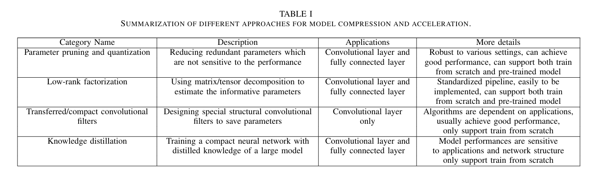
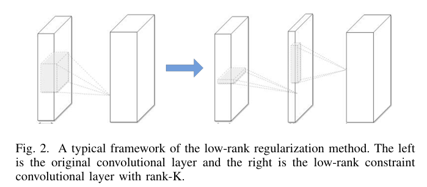

# 论文笔记：A Survey of Model Compression and Acceleration for Deep Neural Networks
**论文标题**：A Survey of Model Compression and Acceleration for Deep Neural Networks   
**作者**：Yu Cheng, Duo Wang, Pan Zhou, Tao Zhang   
**年份**：2017
## 一、核心贡献
系统梳理了深度神经网络压缩与加速领域的主要方法：
1. **提出统一的四类方法分类框架**：将模型压缩与加速技术分为**参数剪枝与共享**、**低秩分解**、**紧凑卷积滤波器设计**、**知识蒸馏**四大类，成为该领域后续研究的重要参考
2. **系统总结代表性工作**：涵盖了 Deep Compression、BinaryNet、SqueezeNet、MobileNet、知识蒸馏等当时重要的方法，并分析了各自优缺点。
3. **指出未来方向**：包括自动化压缩策略、硬件感知设计、多种压缩技术融合、压缩理论基础等
## 二、方法概述
### 2.1 参数剪枝和量化
删除冗余连接或神经元，或让多个权重共享同一组参数，从而减少有效参数量。
#### 2.1.1 参数剪枝
    根据权重大小、梯度等准则删除不重要连接，剪枝后通常需要微调恢复精度。
- 非结构化剪枝：得到稀疏矩阵，压缩率高，但实际加速依赖-专用硬件或稀疏计算库。
- 结构化剪枝：直接剪掉整个滤波器、通道或层，硬件更友好。
#### 2.1.2 参数共享与哈希
    通过聚类、哈希等方式让多个权重共享同一值，减少存储
#### 2.1.3 量化与二值化
    使用 8 bit、4 bit、2 bit 甚至二值表示权重和激活，可将卷积乘加运算转化为位运算，大幅加速。
代表工作：Deep Compression、BinaryConnect、BinaryNet、XNOR-Net、HashedNets。

优点：压缩率高，尤其**适合全连接层和大型卷积网络**。    
缺点：非结构化稀疏导致**访存不规则**，实际加速有限；过度量化会带来精度损失。
### 2.2 低秩分解
    将原始卷积核或权重矩阵分解为多个更小的矩阵或张量，减少参数和计算量。
- 全连接层使用 SVD 分解
- 卷积层使用 CP 分解、Tucker 分解、Tensor Train 分解等张量分解方法
- 用多个低秩滤波器近似原始大卷积核  

优点：理论成熟，对较大的卷积核和全连接层效果明显。  
缺点：现代网络多用 3×3 或 1×1 小卷积核，分解收益下降；分解后网络结构复杂，训练困难。
### 2.3 紧凑卷积滤波器设计
    不依赖对已有大模型的后处理压缩，而是直接设计更高效的卷积结构和滤波器，使网络天然更小、更快。    
- 用堆叠的小卷积核替代大卷积核。
- 使用 1×1 卷积或瓶颈结构降低通道数。
- 深度可分离卷积：将标准卷积分解为 depthwise 卷积和 pointwise 1×1 卷积。
- 分组卷积：减少计算量  

代表工作：SqueezeNet、MobileNet、Xception、ResNeXt。    
优点：结构规则，硬件友好，容易获得实际加速；是现代高效网络设计的主流方向。  
缺点：需要针对具体任务和硬件设计结构，过于紧凑的结构可能限制表达能力。
### 2.4 知识蒸馏
    利用大型预训练教师网络提供“软标签”或中间表示，指导小型学生网络学习，使小模型获得接近大模型的性能。  
- 使用带温度参数 T 的 softmax 输出作为软标签。
- 学生网络同时拟合教师软标签和真实硬标签。
- 进一步扩展：利用教师中间层特征、注意力图等指导学生网络。  

优点：不限制学生网络结构，可与任意紧凑网络结合；能有效提升小模型精度。  
缺点：需要先训练大教师网络，训练成本较高；单独使用蒸馏压缩率不如剪枝、量化等方法高。
## 三、关键图表解读
### 3.1 模型压缩与加速不同方法总结
  

| 类别名称 | 描述 | 应用场景 | 更多细节 |
|---|---|---|---|
| 参数剪枝与量化 | 减少对性能不敏感的多余参数 | 卷积层和全连接层 | 对各种设置鲁棒，可获得良好性能，支持从头训练和预训练模型 |
| 低秩分解 | 使用矩阵/张量分解来估计信息性参数 | 卷积层和全连接层 | 流程标准化，易于实现，支持从头训练和预训练模型 |
| 迁移/紧凑卷积滤波器 | 设计特殊结构的卷积滤波器以节省参数 | 仅卷积层 | 算法依赖于具体应用，通常获得良好性能，仅支持从头训练 |
| 知识蒸馏 | 使用大型模型的蒸馏知识来训练紧凑型神经网络 | 卷积层和全连接层 | 模型性能对应用和网络结构敏感，仅支持从头训练 |
### 3.2 低秩正则化方法
    

## 四、个人思考 
文章是2017年的，建立了关于模型压缩分类的清晰框架，但随着近年来大模型技术的飞速发展，部分内容有些过时。

“知识蒸馏”严格来说并不直接压缩已有模型，而是训练一个小模型，因此它与前三类的目标略有不同。另外，低秩分解在现代网络中的影响力逐渐减弱，而结构设计、量化、剪枝的组合成为主流。

2017 年前后，很多工作还集中在如何对已经训练好的大模型做后处理压缩，但后来 MobileNetV2/V3、EfficientNet、ShuffleNet 等高效网络结构的大量出现，说明直接从设计源头追求效率往往更有效。实际上就是文中提到的“紧凑卷积滤波器”的进一步发展。

论文已经强调“参数少不等于速度快”，但在当时，针对特定硬件的自动压缩工具还比较缺乏。如今，像 TensorRT、TVM、硬件友好的稀疏计算、NPU 上的低比特推理等，使得压缩方法必须与硬件特性深度绑定，这也验证了论文对硬件感知设计的呼吁。

这篇综述主要覆盖 CNN 和全连接网络。如今 Transformer 等大模型的压缩、量化、蒸馏、剪枝问题更加突出，催生了大量新方法，例如量化感知训练、稀疏注意力、MoE 蒸馏等。但核心思想依然可以在本文的四类框架中找到影子。