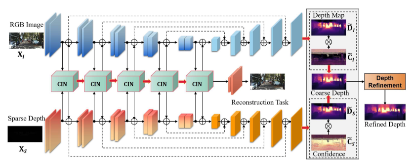
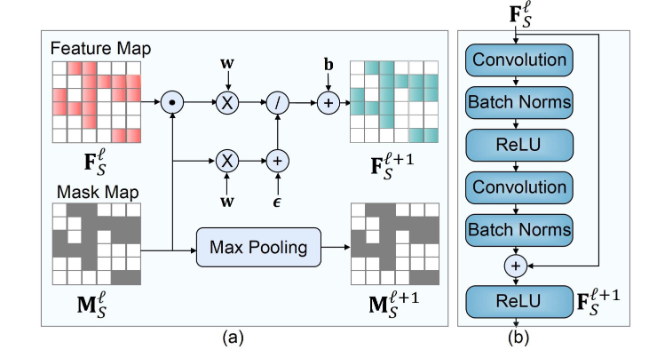

# Embodied Intelligence: A Synergy of Morphology, Action, Perception and Learning

- **作者**：Huaping Liu（清华大学）、Di Guo（北京邮电大学）、Angelo Cangelosi（曼彻斯特大学）
- **出处**：*ACM Computing Surveys*, Vol. 57, No. 7, Article 186, 2025年3月，共36页
- **DOI**：10.1145/3717059

---

## 1. 核心贡献

本文的核心贡献在于**跳出“算法中心主义”** ，提出了一个系统性的具身智能协同分析框架。具身智能强调智能受**大脑、身体与环境的紧耦合**影响，智能通过信息感知和物理交互的过程持续、动态地生成。

具体贡献包括：

1. **四维协同框架**：明确提出具身智能是**形态（Morphology）、动作（Action）、感知（Perception）和学习（Learning）** 四个维度的有机协同体，而非孤立模块的简单堆砌。

2. **聚焦组件间连接性**：论文的核心创新在于**主要关注四个组件之间的连接**（而非各自本身），并识别未来研究可以从这些内在连接中受益的领域。

3. **形态计算的理论深化**：将“身体结构可以分担计算负担”的形态计算思想系统化，引入具身智能的理论体系。

4. **PPA闭环范式的系统阐释**：从感知-规划-行动（Perception-Planning-Action）闭环视角，结合生物学实验证据（Held和Hein的小猫实验），论证主动感知-行动交互对智能发展的必要性。

5. **诊断领域瓶颈**：尖锐指出当前研究在组件协同、触觉感知滞后、Sim2Real迁移及强化学习泛化性等方面的核心局限。

---

## 2. 方法概述

作为一篇综合性综述（Survey），本文不提出新的算法，而是通过**系统性文献分析与理论框架构建**，对已有研究进行分类、归纳和批判性审视。方法框架如下：

### 2.1 分类学方法（Taxonomy）

论文按照**M（形态）、A（动作）、P（感知）、L（学习）** 四个维度对所有具身智能研究进行编码归类：

#### （1）形态维度（Morphology）

形态维度的核心概念是**形态计算（Morphological Computation）** ——机器人身体的形状、变形和动力学可以分担部分原本需要“大脑”完成的控制计算。

- **被动行走机器人**：20世纪90年代开发的被动行走机器人，通过特殊的形态结构设计，无需主动控制输入就能在缓坡上实现稳定步态——完全摆脱了对关节力矩控制的严苛要求。
- **弹性脊柱四足机器人**：利用形态计算实现快速奔跑。
- **蛇形机器人**：利用动态形态计算生成周期性步态。
- **软体机器人**：利用柔顺性、变形和形态计算实现与复杂环境的安全、自适应交互。

#### （2）动作维度（Action）

动作是智能体与环境进行物理交互的直接途径。论文系统梳理了动作生成的核心方法：

- **强化学习（Reinforcement Learning）** ：作为动作生成的核心方法，其基本思想可追溯到Bellman（1950年代）提出的马尔可夫决策过程（MDP），Watkins（1989年）的Q-learning算法为后续发展奠定了基础。实际应用中，研究者直接使用**PPO（Proximal Policy Optimization）、SAC（Soft Actor-Critic）** 等成熟的深度强化学习算法生成动作，关键任务在于根据具体任务确定**状态空间、动作空间和奖励函数**。
- **逆强化学习与模仿学习**：在推进机器人控制和技能获取方面发挥了关键作用。

#### （3）感知维度（Perception）

论文从具身智能视角重新审视感知问题，强调感知不是被动的信息接收，而是与身体结构和动作能力紧密耦合的主动过程：

- **视觉感知**：在具身智能中占据主导地位，但论文指出单纯依赖视觉存在根本局限。
- **触觉感知**：论文特别强调触觉感知的紧迫性——由于现有传感器以及感知和学习方法的局限，机器人触觉研究的发展远落后于视觉和听觉等其他感知模态。触觉感知要求传感器材料和时序预测算法的双重突破。
- **多模态感知融合**：触觉-形态的同步感知使软体机器人实现传感器-运动自主性。

#### （4）学习维度（Learning）

学习是智能体通过经验改善自身行为的能力：

- **深度Q网络（DQN）** ：将卷积神经网络的特征提取能力与强化学习的动作学习能力相结合，在棋类博弈等领域取得巨大成功。
- **强化学习的局限**：仍面临**收敛困难、泛化能力差**等问题。
- **大模型赋能的具身学习**：论文指出当前（2024-2026年）多模态大模型（如GPT-4V）在物理世界中表现不佳，本质原因在于只完成了感知和部分规划，严重缺失行动带来的实时反馈数据。

### 2.2 关系分析法

论文的核心方法创新在于**重点分析维度间的连接性（Connectivity）** ：

| 连接方向 | 含义 | 技术内涵 |
|---------|------|---------|
| **M → A**（形态→动作） | 形态计算 | 身体结构分担控制计算，降低能耗和控制器复杂度 |
| **L → A**（学习→动作） | 学习生成策略 | 通过RL、IL等方法将经验转化为动作策略 |
| **感知 ↔ 形态/动作** | 感知-行动紧耦合 | 感知受身体结构和动作能力影响，行动改变感知输入 |

### 2.3 范式演绎：PPA闭环

论文系统阐释了**感知-规划-行动（Perception-Planning-Action, PPA）** 闭环范式：

- **闭环性**：智能体通过感知获取环境信息→基于感知进行规划→将规划转化为行动→行动结果反馈到新一轮感知，形成持续循环。
- **紧耦合性**：三个环节紧密耦合，任何一个环节的变化都会影响其他环节。
- **生物学证据**：引用Held和Hein的**小猫实验**——主动移动的小猫发育出正常感官-运动系统，被动移动的小猫则表现出严重障碍。这有力证明了**主动的感知-行动交互**对智能发展的必要性。

### 2.4 基准比较

论文对比了**仿真环境（Sim）与真实环境（Real）** 下不同方法的性能表现：

- **Sim2Real的核心挑战**：具身智能研究主要依赖仿真环境进行训练和评估，但仿真环境要么缺乏真实感，要么需要昂贵的硬件进行高保真重建。
- **形态计算的优势**：在Sim2Real迁移中展现出一定优势，但整体迁移仍面临巨大挑战。

---

## 3. 关键图表解读

   

该图展示了一个面向具身智能感知环节的**多模态深度补全与细化流程**：系统以RGB图像 \( X_I \) 和由激光雷达或结构光传感器获取的稀疏深度图 \( X_S \) 作为双模态输入，通过串联的多个**CIN（条件实例归一化，Conditional Instance Normalization）**模块进行跨模态特征交互与融合，并在重建任务分支中同时输出初始密集深度图和评估预测可靠性的置信度图；最后，利用该置信度图作为权重引导，对初始深度图进行精细化修正，输出高质量的稠密深度图。该流程的核心价值在于，它通过**视觉语义（RGB）与物理测距（稀疏深度）的互补**，克服了单一视觉传感器在纹理缺失或光照变化下的深度估计失效问题，为具身智能体后续的**运动规划、避障和精细操作**提供了高可信度的环境几何感知基础，体现了PPA范式下“感知环节”中多源数据紧耦合的典型技术实现。

---

该图展示了一个面向具身智能稀疏感知数据（如激光雷达点云或稀疏深度图）的**掩码引导型特征传播模块**。其核心计算流程分为两条并行路径：**主路径**接收上一层的稀疏特征图 ，依次通过卷积（提取局部空间模式）、ReLU（引入非线性）和批归一化（加速收敛并稳定训练），输出更高语义层次的 ；**辅路径**同时接收对应的掩码图（标记有效数据位置），通过最大池化进行下采样，生成权重系数  并输出更新后的掩码 ，用以指明中各位置的数据有效性。该模块的设计精髓在于**利用掩码显式地抑制无效空洞区域的卷积响应**——池化后的权重 \( W \) 会参与门控或稀疏聚合运算，确保卷积核仅在有效的物理测距点上计算，防止“空值”特征在层层传播中污染密集区域的表征。这本质上构建了一个**稀疏卷积算子**，解决了传统密集卷积在处理非结构化传感器数据时的计算冗余和语义模糊问题，使网络能够高效且精准地保留被遮挡物体的几何边缘与结构细节，为后续的深度图细化或三维物体识别提供高保真的特征基座。

---
## 4. 个人思考

**1. 传统AI研究者常将硬件视为算法的“载体”和“拖累”，但本文让我重新审视物理实体的价值。“形态计算”的提出极具启发性——它暗示未来智能的竞争不仅在于大模型参数，还在于**仿生材料、柔性驱动器和机械结构的创新**。这或许是中国在具身智能领域“换道超车”的一个切入口（硬件制造能力强）。

**2. 当前火热的多模态大模型（如GPT-4V）在物理世界中表现不佳，本质原因在于它们只完成了PPA中的“P（感知）”和部分“P（规划）”，而严重缺失“A（行动）”带来的实时反馈数据。**没有行动带来的痛觉、触觉和失败，智能体永远无法建立真实的物理因果逻辑**。

**3. 论文指出了协同的重要性，但未给出M-A-P-L协同的**统一数学建模**。目前四个维度的优化（形态优化用贝叶斯、学习用梯度下降）处于不同的数学空间，**如何在一个统一的目标函数下联合优化“物理结构”与“网络参数”** 仍是未被解决的硬骨头。这篇综述画出了“理想蓝图”，但距离“施工图纸”还有很长距离。

**4. 论文反复强调触觉滞后，这非常契合工业界痛点。视觉可以“一眼看完”，但触觉必须“亲历亲为”。在没有触觉大模型基座的现状下，机器人操作的上限被极大约束。未来的研究热点大概率会从视觉转向**多模态触觉序列建模**——这需要传感器材料和时序预测算法的双重突破。

**5. 论文最核心的贡献在于明确提出：**具身智能是四个组件的协同体，而非各自本身**。这一洞察看似简单，实则深刻——它要求研究者从“优化单个模块”的思维转向“设计组件间连接”的思维。就像生物的进化不是优化眼睛或腿，而是优化眼睛与腿如何协同工作。
